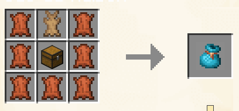

# Sac de maison

## Craft

<figure><figcaption>
Craft du sac de maison
</figcaption></figure>

## Utilisation

En faisant un clic droit avec l'item en main, vous pourrez vous téléporter à votre [**maison**](../commandes/maisons.md).

## Obtention

Pour obtenir les items nécessaires à ce craft, vous devrez tuer des vaches pour obtenir du **cuir** et tuer des lapins pour obtenir une **peau de lapin**.
