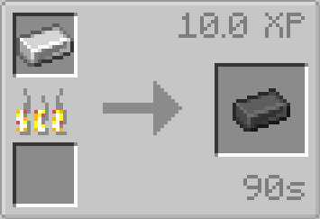
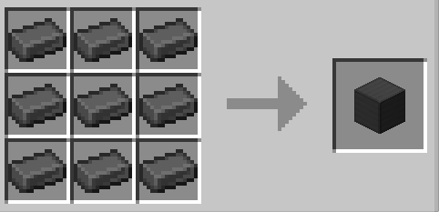
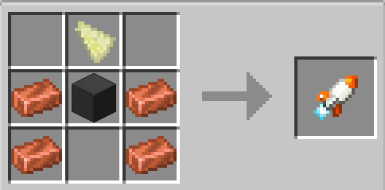
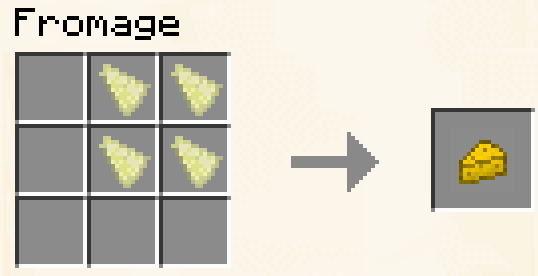
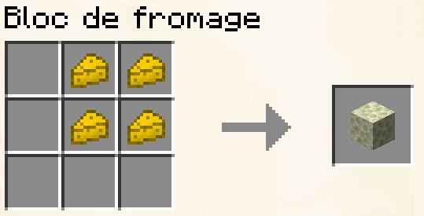
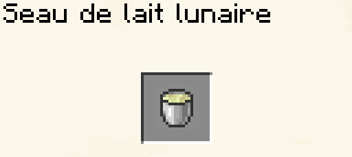

# Lune

## Comment aller sur la lune



### Crafter une fusée

#### Ressources nécessaires



<figure><figcaption>
space:furnace_steel_ingot
</figcaption></figure>

Cuire du fer dans un four pour fabriquer un lingot d'acier



<figure><figcaption>
space:steel_block_0
</figcaption></figure>

Avec 9 lingots d'acier !



<figure><figcaption></figcaption></figure>

Pour l'obtenir, il faut regarder la lune avec un télescope



#### Crafter la fusée

On utilise un fragment de lune, un bloc d'acier et quatres lingots de cuivre !




### Mettre un bloc de verre sur ça tête

Attention ! Il n'y a pas d'oxygène sur la lune, alors pense bien à mettre un bloc de verre sur ta tête car sinon tu suffoqueras !&#x20;



### Charger la fusée avec 1024 de charbon




### Appuyer sur Lancer

Et c'est parti ! Te voila sur la Lune 🚀



***

## Ressources de la lune :

### Fromage

Le Fromage est une nourriture équivalente au steak

<figure><figcaption></figcaption></figure>

<figure><figcaption>
4 Éclats de lune
</figcaption></figure>

***

### Block de fromage



<figure><figcaption>
space:cheese_block_0
</figcaption></figure>




* 4 Fromage



***

### Seau de lait Lunaire



<figure><figcaption></figcaption></figure>

Pour vous en procurer il vous faudra traitre un vache dans l'espace



* Seau
* Vache lunaire


