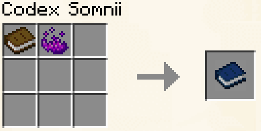
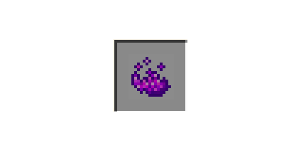
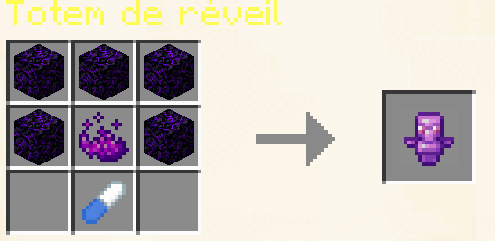
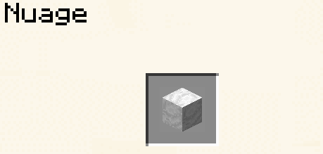
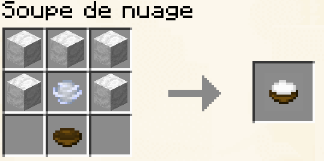
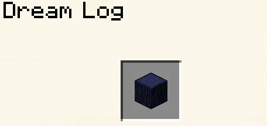

# Rêves

## Insomnie

En dormant, vous avez 1 chance sur 10 (10%) de faire une insomnie, cette Insomnie vous donnera pendant 10 secondes:

* Slowness II
* Weakness
* Blindness

## Bloodmoon (nuit terrifiante)

Il est impossible de dormir pendant la Bloodmoon.

\
Sur le serveur, il n'est pas nécessaire que tout le serveur dorme pour passer la nuit.

Voici les pourcentages

| Nombre de joueurs dans l'overworld | Nombre de joueurs qui doivent dormir |
| ---------------------------------- | ------------------------------------ |
| 1                                  | 1                                    |
| 2                                  | 2                                    |
| 3                                  | 2                                    |
| 4                                  | 2                                    |
| 5                                  | 3                                    |
| 6                                  | 3                                    |
| 7-12                               | 4                                    |
| 13-16                              | 5                                    |
| 17-23                              | 6                                    |
| 24-30                              | 7                                    |
| 31-50                              | 8                                    |
| 51-81                              | 9                                    |
| 82-111                             | 10                                   |
| 112 +                              | 9%                                   |

## [_Dimension des rêves à venir..._](#user-content-fn-1)[^1]

### Codex Somni



<figure><figcaption></figcaption></figure>

Ce manuel vous dira tous se qu'il faut savoir sur la dimension des rêves



* 1 essence de rêve
* 1 livre vierge



***

### Essence de rêve

<figure><figcaption></figcaption></figure>

Pour en obtenir il faut casser des blocks qui on l'apparence d'anciens débris dan la dimension des rêves

***

### Somnifère



<figure><figcaption>
aywen:somniere_0
</figcaption></figure>

Le Somnifère vous permet d'aller dans la dimension des rêves sans passer par un lit🥱

Attention l'abus de somnifère est dangereux pour la santé alors utilisez le avec modération



* 6 sucre
* 3 essences de rêves



***

### Totem de réveil



<figure><figcaption></figcaption></figure>

Comme son nom l'indique le totem de réveil est fait pour se réveillé de ces rêves les plus fous



* 5 Obsidienne pleureuse
* 1 essence de rêves
* 1 somnifère&#x20;



***

### Nuage

<figure><figcaption></figcaption></figure>

Pour le récupérer il vous faudra casser un arbre des rêves

***

### Soupe des nuages



<figure><figcaption></figcaption></figure>

La Soupe de nuage vous permet de voler pendant 5 minutes



* 5 nuages
* 1 charge de Breeze
* 1 Bol



***

### Buche de rêve

<figure><figcaption></figcaption></figure>

Pour en obtenir il vous faut casser des arbres des rêves

***

### Planche de rêve



<figure><figcaption></figcaption></figure>




1 buche de rêve



***

[^1]: Demande d'Aywen :)
