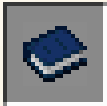
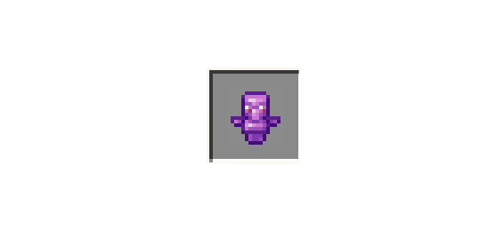
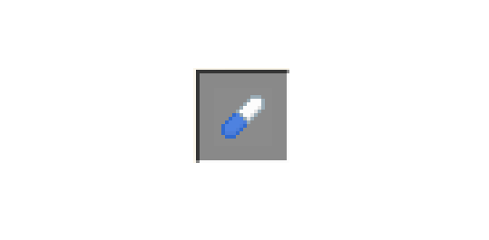
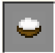

# ℹ️ wiki dream

## Codex Somni

<figure><figcaption></figcaption></figure>

#### Explication:

Ce livre vous dira tous se qu'il faut savoir sur la dimension des rêves

***

## Dream essence

<figure><figcaption></figcaption></figure>

#### Explication:

Un article qui vous servira dans diverses recettes

Obtention:

Il faut casser les débris antiques répartis dans la dimension des rêves pour en obtenir

***

## Undreaming totem

<figure><figcaption></figcaption></figure>

#### Explication:

Ce totem vous permettra de vous évader de la dimension des rêves

***

## Sleeping Pill

<figure><figcaption></figcaption></figure>

#### Explication:

Le somnifère vous permettra d'aller dans la dimension des rêves sans lit

***

## Cloud soup

<figure><figcaption></figcaption></figure>

#### Explication:

Après l'avoir bu, cette soupe te permettra de voler pendant 5 minutes

***
