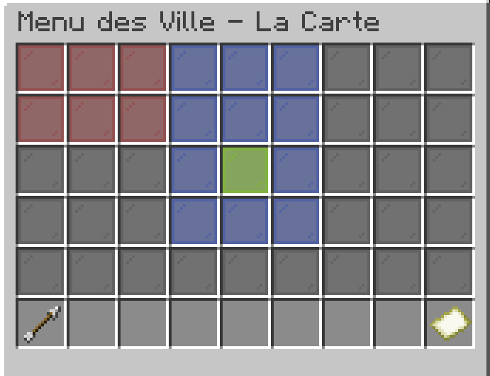
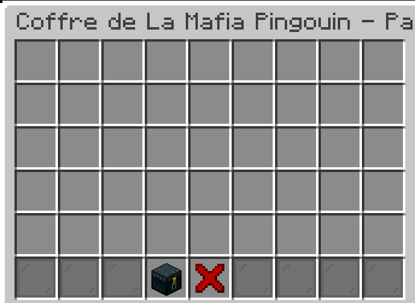

# Les Villes





Sommaire

1. [#la-commande-city](cities.md#la-commande-city "mention")
2. [#creer-une-ville](cities.md#creer-une-ville "mention")
3. [#rejoindre-une-ville](cities.md#rejoindre-une-ville "mention")
4. [#quitter-une-ville](cities.md#quitter-une-ville "mention")
5. [#gerer-les-membres](cities.md#gerer-les-membres "mention")
   1. [#permissions-disponibles](cities.md#permissions-disponibles "mention")
6. [#expulser-un-joueur](cities.md#expulser-un-joueur "mention")
7. [#claim-et-unclaim](cities.md#claim-et-unclaim "mention")
   1. [#par-les-commandes](cities.md#par-les-commandes "mention")
   2. [#par-le-menu](cities.md#par-le-menu "mention")
8. [#stockage-de-la-ville](cities.md#stockage-de-la-ville "mention")
9. [#types-de-villes](cities.md#types-de-villes "mention")
10. [#mascotte-de-la-ville](cities.md#mascotte-de-la-ville "mention")
11. [#banque-de-la-ville](cities.md#banque-de-la-ville "mention")
12. [#banque-de-la-ville](cities.md#banque-de-la-ville "mention")
13. [#warp-de-la-ville](cities.md#warp-de-la-ville "mention")
14. [#liste-des-villes](cities.md#liste-des-villes "mention")

## La commande /city

Cette commande est la principale commande utilisée pour les villes. Elle permet de rejoindre, quitter, gérer les membres et la mascotte,...\
Bref, tout ce qu'il y a en lien avec les villes. Vous pouvez utiliser soit le menu (`/city`) soit les commandes (`/city [sous-commande]`).

<table><thead><tr><th width="190">Commande</th><th>Description</th></tr></thead><tbody><tr><td>/city</td><td>Ouvre le menu des villes.</td></tr><tr><td>/city create &#x3C;nom></td><td>Crée une ville avec le nom spécifié.</td></tr><tr><td>/city invite &#x3C;joueur></td><td>Invite un joueur à rejoindre votre ville.</td></tr><tr><td>/city accept &#x3C;nom></td><td>Rejoint la ville qui vous a invité.</td></tr><tr><td>/city deny &#x3C;nom></td><td>Refuse l'invitation à rejoindre une ville.</td></tr><tr><td>/city leave</td><td>Quitte la ville dans laquelle vous êtes.</td></tr><tr><td>/city kick &#x3C;joueur></td><td>Exclut un joueur de la ville.</td></tr><tr><td>/city map</td><td>Ouvre le menu carte.</td></tr><tr><td>/city mayor</td><td>Ouvre le menu du maire.</td></tr><tr><td>/city rename &#x3C;nom></td><td>Renomme la ville.</td></tr><tr><td>/city ranks</td><td>Ouvre le menu des grades.</td></tr><tr><td>/city info</td><td>Affiche les informations de la ville.</td></tr><tr><td>/city bank</td><td>Ouvre la banque de la ville.</td></tr><tr><td>/city chest</td><td>Ouvre le coffre de la ville.</td></tr><tr><td>city upgradechest</td><td>Améliore le coffre de la ville.</td></tr><tr><td>/city claim</td><td>Claim le chunk ou vous vous trouvez pour la ville, s'il n'est pas déjà claim.</td></tr><tr><td>/city unclaim</td><td>Unclaim le chunk ou vous vous trouvez pour la ville, s'il est déjà claim.</td></tr><tr><td>/city list</td><td>Affiche la liste des villes existantes.</td></tr><tr><td>/city setwarp</td><td>Définit le warp de la ville à votre position actuelle.</td></tr><tr><td>/city warp</td><td>Vous téléporte au warp de la ville, s'il a été défini.</td></tr><tr><td>/city type</td><td>Ouvre le menu de type de ville.</td></tr><tr><td>/city transfer &#x3C;joueur></td><td>Transfère la propriété de la ville à un autre joueur.</td></tr><tr><td>/city chat</td><td>Active ou désactive le chat de la ville.</td></tr><tr><td>/city perms</td><td>Ouvre le menu des permissions de la ville.</td></tr><tr><td>/city ranks</td><td>Ouvre le menu des grades de la ville.</td></tr></tbody></table>

## Créer une ville

Pour créer une ville, utilisez la commande `/city create <nom>`. Lorsque vous créez une ville, celle-ci sera automatiquement en type PAIX, ce qui signifie qu'elle ne peut pas être attaquée et ne peut pas attaquer d'autres villes. Vous disposerez de 300 secondes pour poser la mascotte à l'aide du bâton de mascotte, sinon la ville sera supprimée.

Vous pouvez ensuite inviter d'autres joueurs à rejoindre votre ville en utilisant la commande `/city invite <joueur>`.


Lorsque la ville est créée, vous serez en automatiquement défini propriétaire. Pour transférer la propriété de la ville à un autre joueur, utilisez la commande `/city transfer <joueur>`. Le joueur doit être membre de la ville pour pouvoir recevoir la propriété.

Une fois que vous avez transféré la propriété, vous ne pourrez plus gérer la ville à moins d'être réinvité par le nouveau propriétaire.


***

## Rejoindre une ville 

Pour rejoindre une ville, vous devez d'abord être invité par un joueur qui en est le maire ou un membre. Une fois que vous avez reçu l'invitation, vous pouvez accepter en utilisant la commande `/city accept <nom>` ou en cliquant sur l'invitation dans le chat.

***

## Quitter une ville 

Pour quitter une ville, utilisez la commande `/city leave`. Vous serez alors retiré de la ville et ne pourrez plus interagir avec ses fonctionnalités.


&#x20;Si vous êtes le propriétaire, vous devrez transférer la propriété de la ville à un autre joueur avant de pouvoir quitter.


***

## Gérer les membres 

Pour gérer les membres de votre ville, vous pouvez utiliser la commande `/city ranks` ou `/city perms` pour définir des rôles et des permissions.

### Permissions disponibles 

<table><thead><tr><th width="233.99993896484375">Permission</th><th>Description</th></tr></thead><tbody><tr><td>Inviter</td><td>Permet d'inviter des joueurs à rejoindre la ville.</td></tr><tr><td>Expulser</td><td>Permet d'exclure des joueurs de la ville.</td></tr><tr><td>Placer des blocks</td><td>Permet de placer des blocs dans la ville.</td></tr><tr><td>Casser des blocks</td><td>Permet de casser des blocs dans la ville.</td></tr><tr><td>Ouvrir les coffres</td><td>Permet d'ouvrir les coffres dans la ville (Shulkers Boxes et EC non compris).</td></tr><tr><td>Interagir</td><td>Permet d'interagir avec les blocs dans la ville (hors coffres et tonneaux).</td></tr><tr><td>Claim</td><td>Permet de claim/unclaim des chunks pour la ville.</td></tr><tr><td>Voir les claims</td><td>Permet de voir les chunks claims par la ville.</td></tr><tr><td>Renommer</td><td>Permet de renommer la ville.</td></tr><tr><td>Déposer de l'argent</td><td>Permet de déposer de l'argent dans la banque de la ville.</td></tr><tr><td>Voir l'argent</td><td>Permet de voir le montant d'argent dans la banque de la ville.</td></tr><tr><td>Retirer de l'argent</td><td>Permet de retirer de l'argent de la banque de la ville.</td></tr><tr><td>Permissions</td><td>Permet de gérer les permissions/grades des membres de la ville.</td></tr><tr><td>Coffre de ville</td><td>Permet d'ouvrir le coffre de la ville.</td></tr><tr><td>Améliorer le coffre</td><td>Permet d'améliorer le coffre de la ville.</td></tr><tr><td>Changer le type de ville</td><td>Permet de changer le type de la ville.</td></tr><tr><td>Déplacer la mascotte</td><td>Permet de déplacer la mascotte de la ville.</td></tr><tr><td>Changer le skin de la mascotte</td><td>Permet de changer le skin de la mascotte.</td></tr><tr><td>Améliorer la mascotte</td><td>Permet d'améliorer la mascotte de la ville.</td></tr><tr><td>Soigner la mascotte</td><td>Permet de soigner la mascotte de la ville.</td></tr><tr><td>Lancer des guerres</td><td>Permet de lancer des guerres contre d'autres villes.</td></tr><tr><td>Gérer les grades</td><td>Permet de créer/modifier/supprimer des grades de la ville.</td></tr><tr><td>Assigner des grades</td><td>Permet d'assigner/désassigner des grades aux membres de la ville.</td></tr></tbody></table>

***

## Expulser un joueur

Pour expulser quelqu'un de la ville, utilisez la commande `/city kick <Joueur>` en ayant la permission de le faire, ou en étant propriétaire de la ville.

***

## Claim et Unclaim 

### Par les commandes

Pour claim un chunk pour votre ville, vous devez vous trouver dans le chunk que vous souhaitez claim — pourvu qu'il ne soit pas déjà claim et qu'il soit adjacent à un autre de vos claims — et utiliser la commande `/city claim`. Cela protégera le chunk contre les autres joueurs et permettra à votre ville d'y construire en toute sécurité.

Pour unclaim un chunk, vous devez vous trouver dans le chunk que vous souhaitez unclaim et utiliser la commande `/city unclaim`. Cela retirera la protection du chunk et permettra à d'autres joueurs de l'utiliser.

### Par le menu

Vous pouvez aussi passer par le menu map (`/city map`) pour claim ou unclaim des chunks :

<figure><figcaption></figcaption></figure>

* Les vitres rouges représentent les chunks claims par une autre ville.
* Les vitres bleues représentent les claims de votre ville.&#x20;
* La vitre verte représente le chunk où vous vous trouvez actuellement.
* Les vitres oranges représentent une zone protégée qui ne peut pas être claim (ex. le spawn).
* Les vitres grises représentent les chunks libres que vous pouvez claim.

Pour claim depuis ce menu il vous suffit de cliquer sur la vitre du chunk à (un)claim.

***

## Stockage de la ville

Pour accéder au stockage de la ville , utiliser la commande `/city chest`.

Vous aurez une interface comme celle-ci où vous pourrez prendre et déposer des items comme dans un coffre :

<figure><figcaption></figcaption></figure>

Dans cet espace, vous pouvez déposer des items qui seront conservés en sécurité, mais accessibles par tous les membres de la ville ayant la permission d'y accéder. **Plusieurs membres ne peuvent pas accéder au coffre en même temps**.

L'espace de stockage de la ville est améliorable depuis le menu en cliquant sur l'ender chest, ou la commande `/city upgradecoffre`. Une amélioration du coffre coûte en argent et en Aywenithes.

***

## Types de villes 

Il existe plusieurs types de villes, PAIX et GUERRE. Une ville de type PAIX ne peut pas être attaquée et ne peut pas attaquer d'autres villes, tandis qu'une ville de type GUERRE peut être attaquée et attaquer d'autres villes. Vous pouvez changer le type de votre ville en utilisant la commande `/city type`.

***

## Mascotte de la ville 

La mascotte est posée lors de la création de la ville et en est le cœur. Elle peut être déplacée et améliorée afin d'avoir plus de PV. Si vous êtes en type GUERRE, la mascotte peut être attaquée et détruite par les autres villes lors des assauts. Nous vous conseillons de bien la protéger et de la soigner si sa vie n'est pas au maximum.

***

## Banque de la ville 

La banque de la ville est un coffre qui permet de stocker de l'argent pour la ville. Vous pouvez y déposer de l'argent pour éviter de le perdre en cas de mort. Vous pouvez y accéder en utilisant la commande `/city bank`.

***

## Warp de la ville 

Pour définir un warp pour votre ville, vous devez être le propriétaire de la ville et vous trouver à l'endroit où vous souhaitez que le warp soit défini. Utilisez la commande `/city setwarp` pour définir le warp. Les joueurs de la ville pourront ensuite se téléporter au warp de la ville avec la commande `/city warp`.

***

## Informations sur les villes 

Pour afficher la liste des villes existantes, utilisez la commande `/city list`. Cela vous montrera les villes disponibles et vous permettra de voir dans quelle ville se trouvent vos amis. Vous pouvez cliquer sur la ville pour en savoir plus.

Si vous préférez le chat, vous pouvez voir les informations de chaque ville en utilisant la commande `/city info <nom>`.
