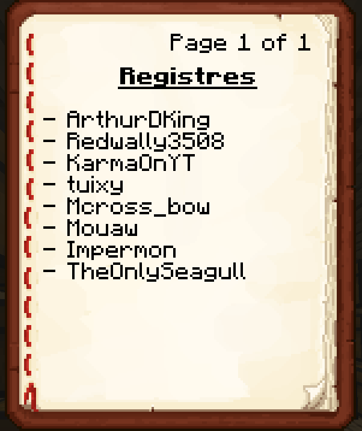
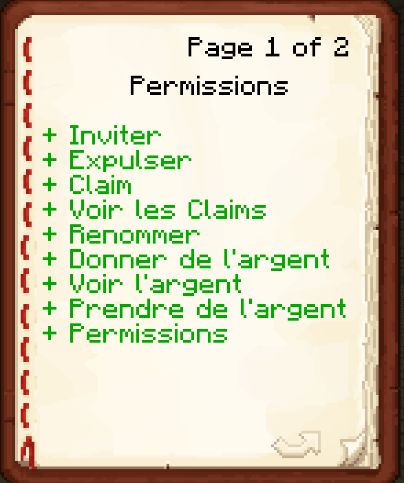

# Les Villes





## La commande /city

Cette commande est la principale commande utilisée pour les villes. Elle permet de rejoindre, quitter, gérer les membres et la mascotte,...\
Bref, tout ce qu'il y a en lien avec les villes. Vous pouvez utiliser soit le menu (`/city`) soit les commandes (`/city [sous-commande]`).

## Pour créé une ville&#x20;

Pour créer une ville, utilisez la commande `/city create` suivie du nom de votre ville. Cette action vous permettra de devenir le maire de cette ville. Assurez-vous de vous positionner à un endroit approprié et voulu car cette commande fera apparaître votre mascotte

```
/city create <MaVille>
```

Après exécution, votre ville sera créée et vous pourrez commencer à la gérer en utilisant d'autres sous-commandes.

***

## Pour supprimer une ville&#x20;

Pour créer une ville, utilisez la commande `/city delete` . Cette action supprimera définitivement votre ville, alors réfléchissez bien avant de le faire et récupérez le contenu de votre bank.

```
/city delete
```

***

## Pour quitter une ville

Pour quitter une ville, utiliser la command `/city leave`

***

## Pour renommer une ville

Pour renommer une ville, utilisé `/city rename <NouveauNom>`

***

## Pour expulser quelqu'un d'une ville&#x20;

Pour expulser quelqu'un de la ville, utiliser la commande `/city kick <Joueur>`

***

## Pour inviter quelqu'un dans sa ville

Pour inviter quelqu'un à rejoindre sa ville, utilisez la commande `/city invite <Joueur>` . Cette action enverra une invitation au joueur voulu. \


### Accepter ou refuser une invitation

Pour accepter ou refuser une invitation vous avez deux possibilité:

* Cliquer sur Refuser ou Accepter dans le message qui est apparu dans le chat
* Faire `/city deny` pour refuser l'invitation ou `/city accept` pour accepter l'invitation

***

## Pour claim un chunk

Avant de claim un chunk assurez vous qu'il est bien adjacent a un claim déjà existent et appartenant a votre ville .

Pour claim un chunk , placer vous dans le chunk voulue et faite `/claim` .

Ou faite la commande `/city` puis cliquer sur le menu <mark style="color:yellow;">Taille de votre ville</mark> ;

Vous aurez une interface comme celle-ci:

<figure><figcaption></figcaption></figure>

* Le verres rouge représente les chunk claim par une autre ville
* Le verre bleu représente vos claim a vous&#x20;
* Le verre vert représente le chunk ou vous vous trouvé actuellement
* Le verre orange représente une zone protégé qui ne peut pas être claim
* Le verre gris représente les chunk libre

Pour claim depuis ce menu il vous faut cliquer sur le verre du chunk a claim puis confirmer.

***

## Stockage de la ville

Pour accéder au stockage de la ville , utiliser la commande `/city chest` .&#x20;

Vous aurez une interface comme celle-ci où vous pourrez prendre et déposer des items comme dans un coffre :

<figure><figcaption></figcaption></figure>

L'espace de stockage de la ville est améliorable depuis le menu de la ville `/city` et la commande `/city upgradecoffre`

***

## Permissions

Pour accéder au menu des permissions des membres de la ville, utilisez la commande `/city permes` si vous y êtes habilité .

Un menu avec la liste des joueurs de votre ville va s'afficher :

<figure><figcaption></figcaption></figure>

Sur ce menu, vous pouvez cliquer sur le joueur dont vous voulez gérer les permissions, puis activer ou désactiver les permissions en cliquant dessus:

* Vert = permission activé
* Rouge = permission désactivé


<figure><figcaption></figcaption></figure>

