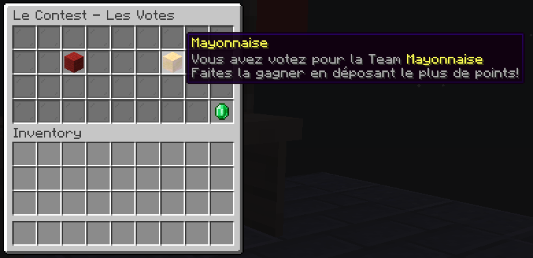
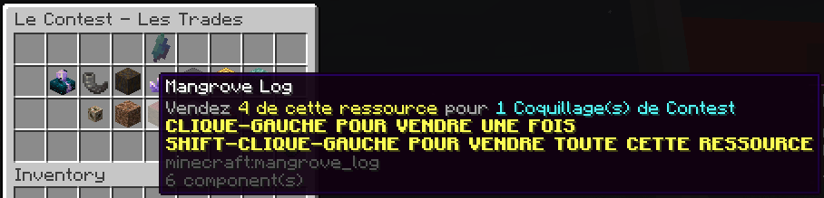
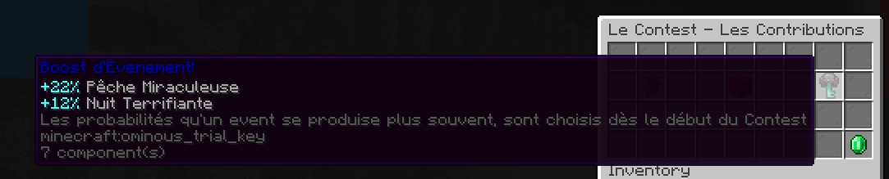

# 🎏 Les Contest

**Toutes les fonctionnalités lié au Contest sont disponible via le /contest ou la Borne des Contest qu'il y a au spawn**
<figure></figure>

## Qu'est ce que c'est?
Les Contest ont pour but d'affronter 2 camps (exemple: Mayonaisse VS Ketchup, et pleins d'autres...).

## Phase 1 : Les Votes !
Les votes commenceront toujours le vendredi à 0h de chaque semaine. Vous aurez 2 choix d'équipe, par exemple Ordre VS Chaos.
<figure></figure>
Le soleil commence à tomber sur le Spawn...

## Phase 2 : L'Affrontement ! 
Un jour après que les votes se sont terminé, donc le samedi à 0h. Le Contest démarre sur une durée de 2 jours.

### 1- Comment avoir des Coquillages de Contest?

Pour donner des points à votre équipe vous devez faire des trades contre des Coquillages de Contest.
<figure></figure>
**Ou bien gagner une animation dans le chat**.

### 2- La Contribution

Il vous faut déposer les Coquillages de Contest pour ajouter des points dans votre Team ! 
<figure></figure>

### 3- Les Boost D'Evenement
<figure></figure>
Les boost d'événement peuvent varier de +5% à +25% d'apparaitre, ils sont choisis aléatoirement
La nuit tombe sur le spawn...

## Phase 3 : Les Résultats !
Les résultats tombent, ils sont basés sur le taux de Coquillages de Contest déposé.
Vous recevrez dans votre boite mail, le Lundi à 0h, un livre et des récompenses en lien avec le Contest.
img boite
Dans ce livre vous pourrez regarder les statistiques générales à propos du Contest, vos statistiques personnelles, et le classement !
img book
