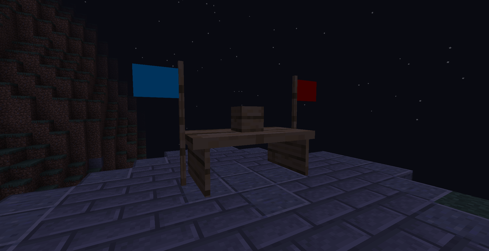
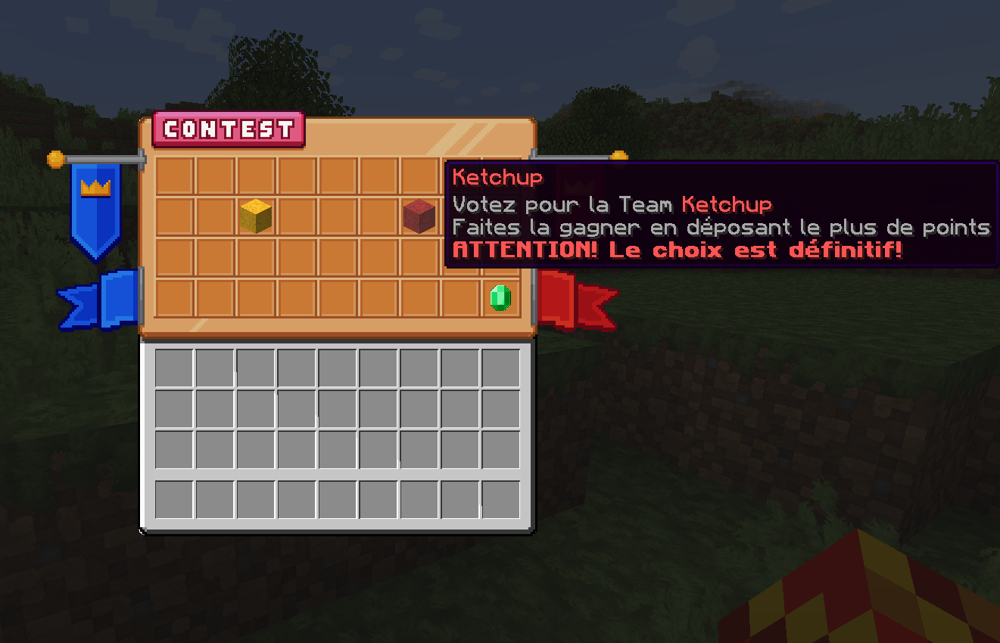
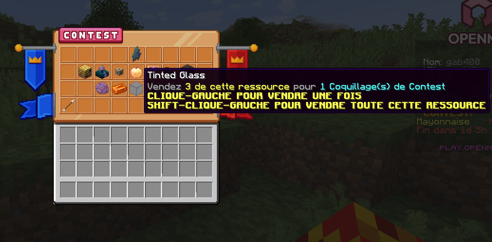
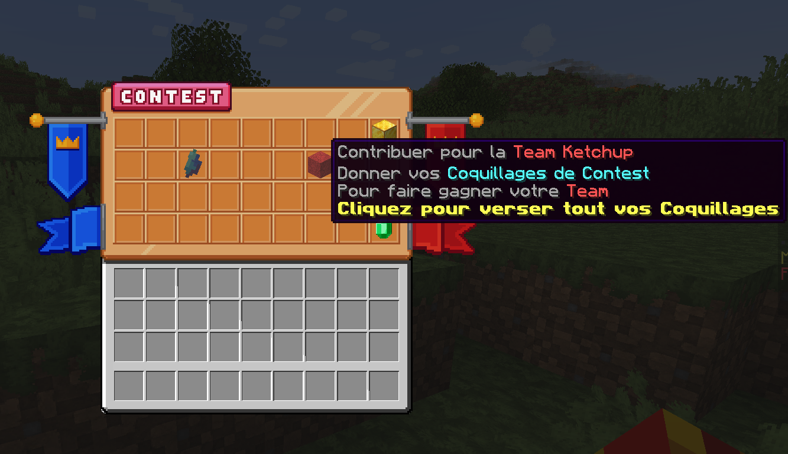
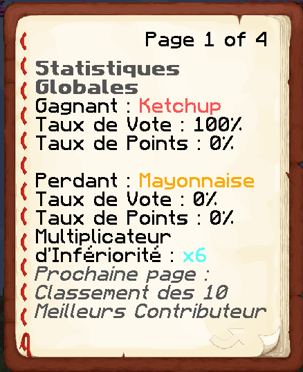
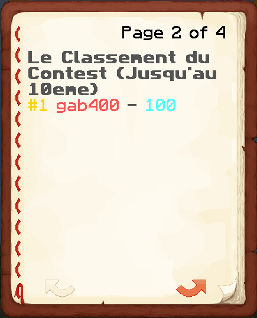

# Les Contest

**Toutes les fonctionnalités liées au Contest sont disponibles via le `/contest` ou la Borne des Contest qu'il y a au spawn**

<figure><figcaption></figcaption></figure>

## Qu'est-ce que c'est ?

Les Contest ont pour but d'affronter 2 camps (exemple : Mayonaisse VS Ketchup, et pleins d'autres...).

## Phase 1 : Les Votes !

Les votes commenceront toujours le vendredi à 0h de chaque semaine. Vous aurez 2 choix d'équipe, par exemple Ordre VS Chaos.

<figure><figcaption></figcaption></figure>

Le soleil commence à tomber sur le Spawn...

## Phase 2 : L'Affrontement !

Un jour après que les votes se sont terminé, donc le samedi à 0h. Le Contest démarre sur une durée de 2 jours.

### 1- Comment avoir des Coquillages de Contest?

Pour donner des points à votre équipe, vous devez faire des trades contre des Coquillages de Contest.

<figure><figcaption></figcaption></figure>

\*\*Ou bien gagner une animation dans le chat\*\*. *(lorsque les animations seront implémentés)*

### 2- La Contribution

Il vous faut déposer les Coquillages de Contest pour ajouter des points dans votre Team !

<figure><figcaption></figcaption></figure>

## Phase 3 : Les Résultats !

Les résultats tombent, ils sont basés sur le taux de Coquillages de Contest déposé. Vous recevrez dans votre boite mail, le Lundi à 0h, un livre et des récompenses en lien avec le Contest. Dans ce livre vous pourrez regarder les statistiques générales à propos du Contest, vos statistiques personnelles, et le classement !

<figure><figcaption></figcaption></figure>
<figure><figcaption></figcaption></figure>
<figure><figcaption></figcaption></figure>
<figure><figcaption></figcaption></figure>
