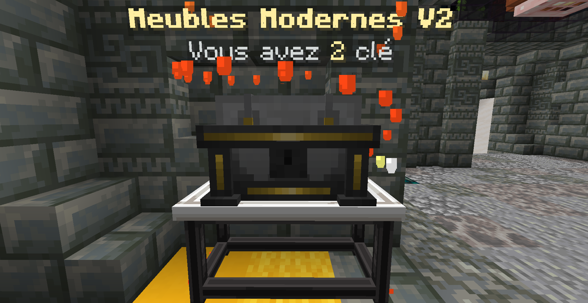
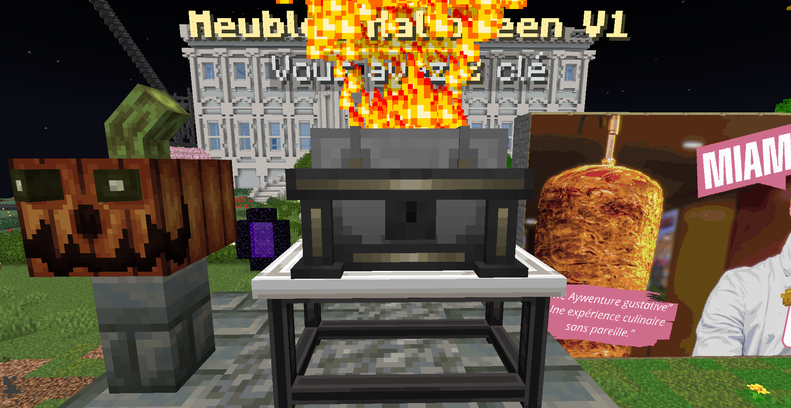
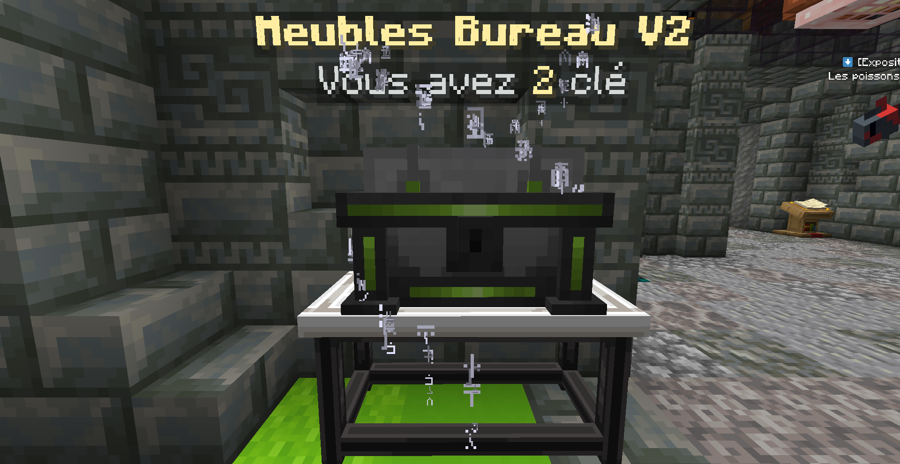
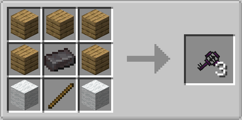

# Lootboxes

Les **Lootboxes** sont présente sous forme de boite de différents style au spawn; des Lootbox spéciales son placé au spawn pour certain événement **Halloween** et **Noël**

<figure><figcaption></figcaption></figure>

 

<figure><figcaption></figcaption></figure>

 

<figure><figcaption></figcaption></figure>

<figure><figcaption></figcaption></figure>

<figure><figcaption></figcaption></figure>

### Clé Lootbox



<figure><figcaption></figcaption></figure>

Pour l'utiliser prenez la dans la main et faite Clic droit sur la Lootbox Meuble que vous voulez ouvrir

Il existe différentes clés de lootbox de différents matériaux et de différentes raretés :

* Common
* Rare
* Epic



* 5 block de bois
* 2 block de laine
* 1 Bâton en bois

Les différent matériaux utilisable pour les clé :

* Lingot d'or
* Améthiste&#x20;
* Diamant
* Emeraude&#x20;
* lingot de fer


