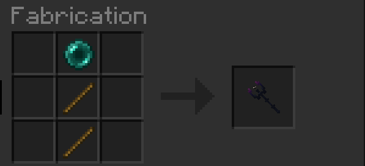

# 🥙 Nourriture

## Kebab : Craft

<figure><figcaption>
Craft du kebab (salade, tomate, oignon, pain)
</figcaption></figure>

<figure><figcaption>
Craft des graines (fonctionne peu importe le légume du craft)
</figcaption></figure>

## Nourriture périmée

Une infime chance de manger un aliment pas frais. Résultat : _je ne vous fait pas un dessin_.
