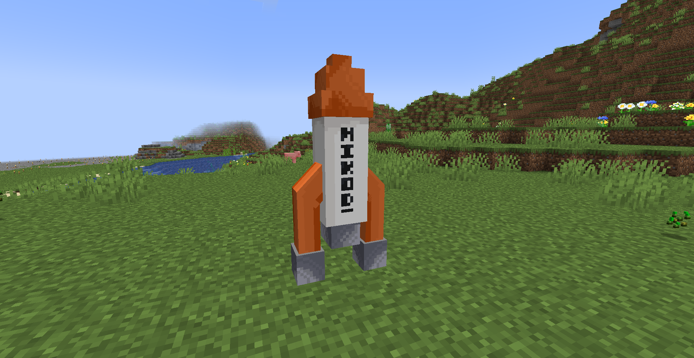
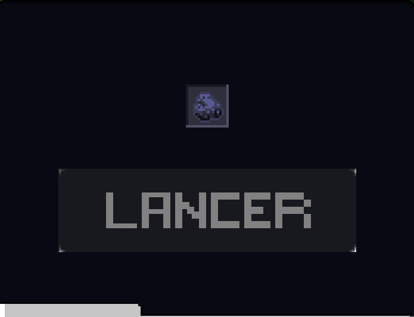
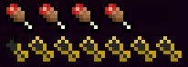

# ℹ️ Wiki moon

## Rocket

<figure><figcaption></figcaption></figure>

 

<figure><figcaption></figcaption></figure>

<figure><figcaption></figcaption></figure>

#### Instruction:

Pour l'utiliser, vous devrez y mettre 1024 charbons
Attention!!!, il n'y a pas d'oxygène sur la lune, alors pense à mettre un bloc de verre sur ta tête car sinon tu suffoqueras

***

## Cheese

<figure><figcaption></figcaption></figure>

#### Explication:

Un aliment similaire au steak

<figure><figcaption></figcaption></figure>
