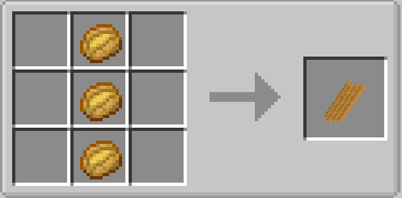
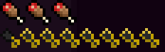

# ⚒️ Craft Features

## Kebab (Merci Gyro)

<figure><figcaption>
aywen:kebab
</figcaption></figure>

<figure><figcaption>
aywen:kebab_fish
</figcaption></figure>

#### Materials\_list

* Salad \*1
* Tomate \*1
* onions \*1
* bread \*1 / Poissonion cuit \*1

***

## Frite

<figure><figcaption></figcaption></figure>

#### Materials list:

* baked\_potato \*3

Régenération:

<figure><figcaption></figcaption></figure>

***

## Home bag 🧳

<figure><figcaption></figcaption></figure>

#### Materials list:

* rabbit\_hide \*1
* leather \*1&#x20;
* chest \*1

***

## Les clef lootbox

<figure><figcaption>
exellentcrate:aywen_crate
</figcaption></figure>

#### Materials list:

* oak\_plank \*5
* wool \*2
* oak\_stick \*1
* Netherite\_ingot \*1

