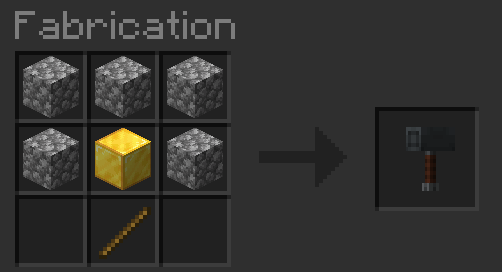

# Marteaux



## Marteau de guerre


Cette arme fait 10 points de dégâts et génère une explosion et un éclair lorsqu'elle est utilisée pour attaquer\
ou lorsque on fait un shift + clique droit sur un bloc. (Non, on ne peut pas la lancer.)


_Cooldown de 60 secondes.50 points de durabilité._



<figure><figcaption></figcaption></figure>



* 5 blocs de cobblestone
* 1 bloc d'or
* 1 bâton



***

## Marteau en Netherite


Le Marteau en Netherite permet de creuser un cube de 3\*3\*3 blocks


_4096 points de durabilité._



<figure><figcaption></figcaption></figure>



* 5 lingot de Netherite
* 2 Bâtons en bois



* Fortune
* Silk touch



***

## Marteau en Diamant


Le Marteau en Diamant permet de creuser un cube de 3\*3\*3 blocks


_2048 points de durabilité._



<figure><figcaption></figcaption></figure>



* 5 block de diamants
* 2 Bâtons en bois



* Fortune
* Silk touch



***

## Marteaux en Fer


Le Marteau en Fer permet de creuser un cube de 3\*3\*3 blocks


_512 points de durabilité._



<figure><figcaption></figcaption></figure>



* 5 block de fer
* 2 Bâtons en bois



* Fortune
* Silk touch


