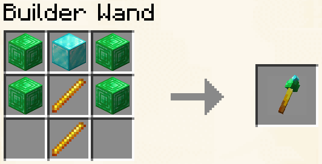

# Wands

## RTP Wand


Cet item vous permet de vous téléporter à un endroit aléatoire sur la map.


_Cooldown de 30 secondes._

### Craft

<figure><figcaption>
Craft de la RTP Wand (2 bâtons + 1 enderpearl)
</figcaption></figure>

***

## Builder Wand



<figure><figcaption></figcaption></figure>




* 2 block d'émeraude
* &#x20;1 block de diamant
* 2 bâtons de blaze



***

### Claim Wand



<figure><figcaption></figcaption></figure>

Pour l'utiliser il faut faire clic droit avec dans un claim , elle vous indiquera la délimitation du claim avec des particules ainsi que sont propriétaire et quelque information relative aux coordonnées&#x20;



* 1 gold ingot
* 2 Oak stick



