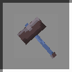
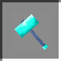
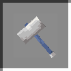
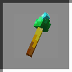
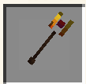
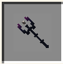

# ℹ️ wiki tools

## Netherite\_Hammer

<figure><figcaption></figcaption></figure>

#### Explication:

Permet de creuser un cube de 3\*3\*3 blocks

#### Durabilité:

?

***

## Diamond\_Hammer

<figure><figcaption></figcaption></figure>

#### Explication:

Permet de creuser un cube de 3\*3\*3 blocks

#### Durabilité:

2048

***

## Iron\_Hammer

<figure><figcaption></figcaption></figure>

#### Explication:

Permet de creuser un cube de 3\*3\*3 blocks

#### Durabitité:

?

***

## Builder\_Wand

<figure><figcaption></figcaption></figure>

#### Explication:

?

#### Durabilité:

?

***

## Claim\_info\_wand

<figure><figcaption></figcaption></figure>

#### Explication:

* La claim\_info\_wand montre les info du claim dans lequel tu a fait clique droit et te montre sa délimitation

***

## Rtp\_Wand

<figure><figcaption></figcaption></figure>

#### Explication:

* Te permet de te téléporter a un endroit aléatoire de l'Overworld
